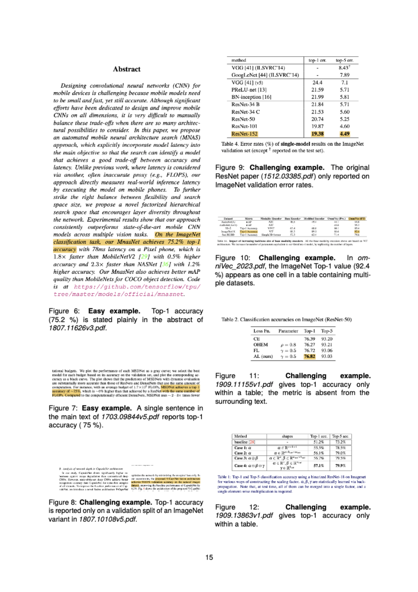

## 📦 Dataset

We release **360 ImageNet papers**, including **100 development**, **100 validation**, and **160 additional annotated** papers, each with **ground-truth labels**.

### 📁 Directory Structure

```
project_root/ 
├── README.md
└── data/
       ├── dev_labels.csv   # gold labels (see table below)
       ├── val_labels.csv   # validation set
       ├── extra_labels.csv # additional 160 manually annotated papers
└── docs/
       ├── SectionF_Screenshots.pdf
       ├── SectionF_Screenshots_thumbnail.png
```

### 🏷️ Columns

| Column       | Description                                                                 |
|--------------|-----------------------------------------------------------------------------|
| `arxiv_name` | PDF filename (e.g., `1312.6229v4.pdf`)                                      |
| `top1_acc`   | Reported Top-1 ImageNet accuracy (**in %**); `NA` indicates not reported    |
| `link` _(optional)_ | Direct link to the PDF (used only for non-arXiv papers)              |

> `NA` → metric absent (e.g., only Top-5 or validation results are reported).


---
### 🔍 Quick Peek

```python
import pandas as pd
df = pd.read_csv('data/val_labels.csv')
print(df.head(8))
```
---
**Example (CSV format):**

```csv
       arxiv_name                                top1_acc                             link
90  1312.6229v4.pdf                                85.82
91  CNN_Hierarchical_Deep_ICCV_2015_paper.pdf       NA          https://openaccess.thecvf.com/content_iccv_2015/papers/Yan_HD-CNN_Hierarchical_Deep_ICCV_2015_paper.pdf

```
### 🌐 External URLs for Reproducibility

To enhance reproducibility for non-arXiv papers (e.g., those from CVPR/ICCV/ECCV), we include an optional `link` column with the direct PDF link.  
For arXiv papers, this field is left blank (a canonical arXiv link can be constructed from the filename if needed).

---
## 📊 Metric Presence Summary

| Metric Presence | Development Set | Validation Set | Extra labels |
|------------------|-----------------|----------------|----------------------|
| **Ground-truth Present** | 26 | 27 | 25 |
| **Ground-truth Absent**  | 74 | 73 | 135 |
| **Total**                | 100 | 100 | 160 |

## 💰 Annotation Costs

The manual data annotation work has been done by the first author of the paper. Therefore, no compensation costs were incurred for data collection/annotation.  
The time investment for the annotation work on a total of **360 papers** is detailed below:

- **Pre-annotation** (about 45 hours) included the development of annotation schema (10h), the writing of annotation guideline (5h), label-verification protocol (10h), preliminary annotation and personalized feedback (20h).  
- **Annotation** (about 360 h) covered a total of
360 papers as annotating individual document
takes 1-2 hours on average.  
- **Post-annotation** (about 45h) consisted of quality checking for cross-checking (30h), data processing and dataset release (15h).  

Overall, our annotation work takes approximately a total of **45+360+45=450 hours (2.5 person-months)**.

---

## 🖼️ Section F – Screenshots from ArXiv Papers with Extract Sections Highlighted

This section provides **visual documentation** of the annotation process, illustrating how Top-1 accuracy regions were identified across representative ImageNet papers.  
The compiled PDF below contains selected screenshots from annotated papers, highlighting the exact **tables, figure captions, and textual regions** from which Top-1 accuracy values were extracted.  

Each example demonstrates either a clear extraction case (explicitly stated Top-1 accuracy) or a challenging case involving ambiguous dataset splits, table-only metrics, or validation-set references. These examples support the qualitative analysis discussed in the paper and provide transparent evidence of annotation consistency.


### 📑 View Embedded PDF
> ⚠️ **Note:** GitHub does **not** support embedded PDF viewing.  Upon clicking the thumbnail below, you will be redirected to the full PDF file in your browser.

[](docs/SectionF_screenshots.pdf)


---

📌 **Note**: All PDFs are distributed strictly for research and benchmarking purposes. Copyright remains with the original publishers.
